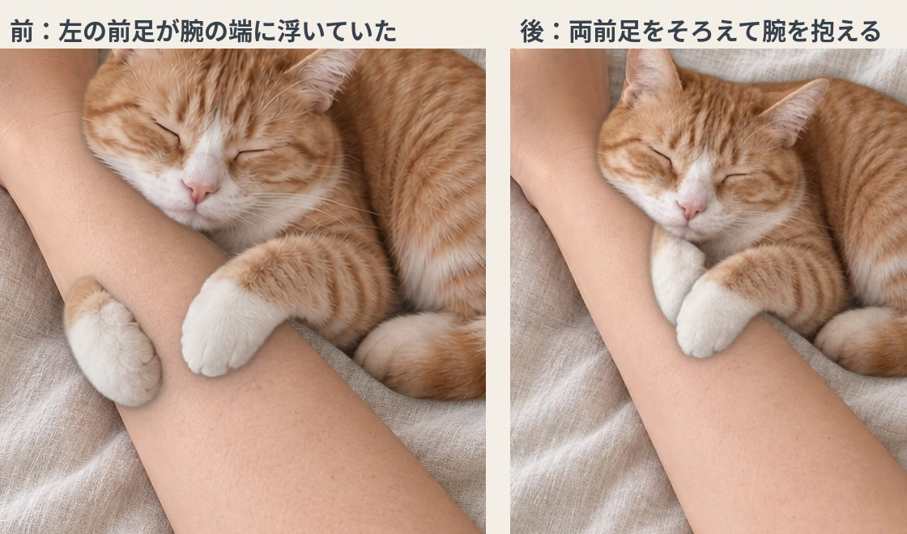

# 添い寝ねこアラーム

腕に抱きついて眠る猫が、設定した時刻になると顔を上げて「ニャー」と鳴いて起こしてくれる、ブラウザで動くアラームです。
猫を飼えない人が、猫と一緒に眠り、猫に起こしてもらう感覚を楽しむためのアプリです。



しぐさの見本動画：[docs/motion_preview.mp4](docs/motion_preview.mp4)（眠る → 耳ぴくっ → 薄目 → 目を開けて甘える → ぺろっ → 鳴いて起こす）

## 使い方

1. `index.html` をブラウザで開きます（ファイル1つで動きます。画像もすべて中に入っています）。
2. 猫を選び、起きる時刻を入れます。過ぎた時刻は翌日になり、日付が表示されます。
3. 「音を試す」で音量を確かめ、「添い寝をはじめる」を押します。
4. 画面を開いたまま、充電しながら、端末の自動ロックをオフにして置いてください。
5. 時刻になると猫が鳴きます。「起きたよ」で止まり、「あと5分」で5分後にもう一度起こします。

「10秒後に試す」で起こす流れ全体を、「音量と表示」→「しぐさを順番に見る」で動きの見本を確認できます。

> スマホで使うときは、GitHub Pages などの https のページとして開くのがおすすめです（画面スリープ防止が使えるのは https のページだけです）。

## できること

- 猫3種類（茶トラ／サバトラ／ラグドール風）。個性は演出上の設定で、実際の猫種や毛柄の性格を表すものではありません。
- 表情は画像を丸ごと切り替えず、部分ごとに動かします。
  - まぶた：薄目・まばたき・ゆっくりまばたき・寝ているときのまぶたの震え
  - 口：鳴き声の音量に合わせて下あごが動く
  - 舌：口から伸びて戻る「ぺろっ」
  - 呼吸（1回約3秒、ときどきため息）、耳のぴくっ、鼻、しっぽの先、頭のゆっくりした揺れ、前足で腕をトントン
- 腕・寝具の写真は固定。呼吸は猫の胴体だけを局所的に変形します。
- アラームは端末の現在日時と目標日時を比べて判定します。スヌーズ、解除、日付またぎ、タブに戻ったときの遅れ表示、再読込後の「再開してください」表示に対応。
- 音量（ゴロゴロ・鳴き声は別々）、動きの強さ、動きを止める、夜間モード（画面を暗くするだけの機能）。
- 猫のコマ割り画像、背景写真、ゴロゴロ音・鳴き声を、アプリ内で追加・差し替えできます（ブラウザ内に保存）。

## 音について

最初から入っている音は Web Audio で合成した**仮の音**です。実際の猫の録音ではありません。
「音を差し替える」から、利用する権利のある音声ファイル（mp3・m4a・wav など）に差し替えられます。

## ブラウザで使う前提

- 画面ロック中・端末のスリープ中・タブを閉じた後は鳴らせません。
- 「スリープ防止」（Screen Wake Lock）は画面が表示されている間だけ効き、すべての停止を防げるわけではありません。
- 別のタブを見ている間はタイマーが遅れることがあります。戻ったときに時刻を確認し、遅れて鳴らした場合はその旨を表示します。

## フォルダ構成

| 場所 | 中身 |
| --- | --- |
| `index.html` | 完成したアプリ（1ファイル。`tools/build.py` で作る） |
| `src/js/` | プログラム本体（設定・保存・合成音・音声・画像・描画・動き・アラーム・スリープ防止・画面） |
| `src/body.html`, `src/app.css` | 画面の部品と見た目 |
| `assets/` | 猫の表情素材（WebP）、背景写真、目・口・舌などの位置データ `meta_v2.json` |
| `materials/` | 元の画像素材と制作依頼書 |
| `tools/build.py` | `src/` と `assets/` から `index.html` を作る |
| `tools/asset_pipeline/` | 元画像から表情素材を作り直すスクリプト（`run_all.py`） |
| `tests/` | ブラウザでの動作確認（Playwright） |
| `docs/` | 見本動画・比較画像 |

## 開発メモ

```bash
python3 tools/build.py                       # index.html を作り直す
python3 tools/asset_pipeline/run_all.py      # 元画像から assets/ を作り直す（numpy, opencv-python, pillow, scipy）
python3 tests/t_flow.py                      # アラームの流れの確認（playwright）
```

- 猫を増やすとき：`src/js/s1_config.js` の `CAT_PROFILES` に1件足し、`assets/` に素材を置きます。アプリ内の「猫を追加する」からも追加できます（この場合はコマの切り替えで表情を出します）。
- 目・口・舌・耳などの位置は `assets/meta_v2.json`（元の値は `tools/asset_pipeline/export_v2.py` の `RIG`）にあります。

## さらに本物らしくするための追加素材

1. 同じ角度・同じ猫で、目を閉じた顔と開いた顔
2. 背景・腕・猫の胴体・頭・前足・しっぽを分けた素材
3. 利用権の確認できた、実際の猫のゴロゴロ音と複数の鳴き声
